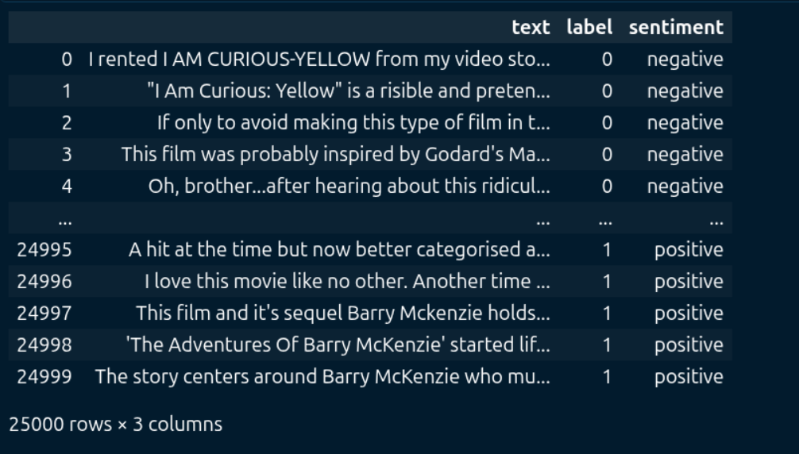
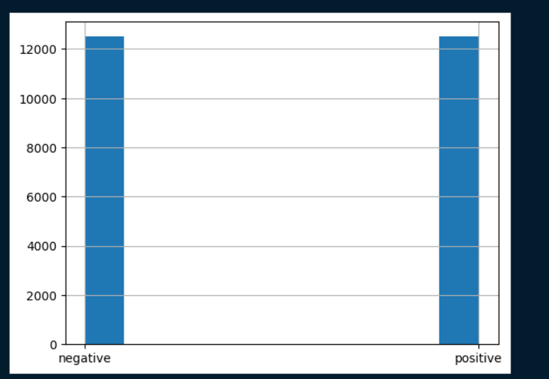
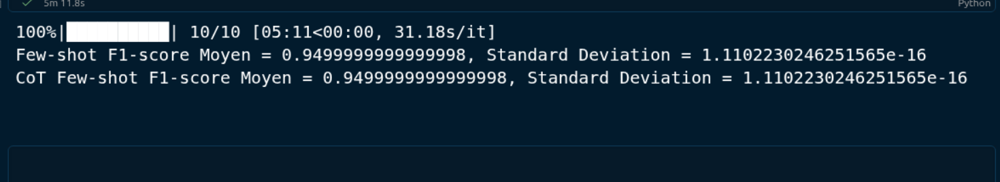

# 🧠 SMA — Prompt Engineering for Multi-Agent Systems
### Sentiment Analysis on IMDb Movie Reviews

<div align="center">

[](https://www.python.org/)
[](https://openai.com/)
[](https://huggingface.co/datasets/imdb)
[](LICENSE)

*Exploring Zero-Shot · Few-Shot · Chain-of-Thought prompting strategies with GPT-4o*

</div>

---

## 📋 Table of Contents

- [Overview](#-overview)
- [Project Structure](#-project-structure)
- [Key Features](#-key-features)
- [Installation](#️-installation)
- [Methodology](#-methodology)
  - [Zero-Shot Prompting](#zero-shot-prompting)
  - [Few-Shot Prompting](#few-shot-prompting)
  - [Chain-of-Thought (CoT) Prompting](#chain-of-thought-cot-prompting)
- [Dataset](#-dataset)
- [Evaluation](#-evaluation)
- [Results](#-results)
- [Future Work](#-future-work)

---

## 🎯 Overview

This project explores **Prompt Engineering techniques** applied to **sentiment analysis** using the IMDb movie reviews dataset. We evaluate three distinct prompting strategies with GPT-4o to classify reviews as **positive** or **negative**, measuring performance through F1-score and stability across multiple runs.

The work serves as a foundation for **Multi-Agent Systems**, where specialized agents can be orchestrated with optimized prompts for specific NLP tasks.

---

## 📁 Project Structure
```
sma-prompt-engineering/
├── .venv/
├── .env/
├── .gitignore
├── .python-version
├── pyproject.toml
├── README.md
├── sa.ipynb
└── uv.lock
```

---

## ✨ Key Features

| Feature | Details |
|---|---|
| 📦 **Dataset** | IMDb movie reviews — 25,000 training samples via HuggingFace |
| 🤖 **Model** | OpenAI GPT-4o · `temperature=0` for deterministic outputs |
| 📐 **Metric** | Micro F1-score on 20 held-out golden examples |
| 🔁 **Stability** | 10 evaluation runs with randomized few-shot examples |
| 🧪 **Strategies** | Zero-Shot · Few-Shot · Chain-of-Thought |

---

## 🛠️ Installation

### 1. Clone the repository
```bash
git clone https://github.com/yourusername/sma-prompt-engineering.git
cd sma-prompt-engineering
```

### 2. Create a virtual environment
```bash
python -m venv venv
source venv/bin/activate  # Windows: venv\Scripts\activate
```

### 3. Install dependencies
```bash
pip install -r requirements.txt
```

### 4. Set up environment variables

Create a `.env` file at the root:
```env
OPENAI_API_KEY=your-api-key-here
```

---

## 🔬 Methodology

### Zero-Shot Prompting

The model receives only a system instruction — **no examples provided**.
```
System Message:
Classify the sentiment of movie reviews presented in the input as
'positive' or 'negative'. Movie reviews will be delimited by triple
backticks in the input. Answer only 'positive' or 'negative'.
Do not explain your answer.
```

---

### Few-Shot Prompting

The model receives **8 labeled examples** (4 positive, 4 negative) before classifying new reviews. Examples are randomly sampled from the training set.
```
User:   ```{movie_review}```
Assistant: positive
```

---

### Chain-of-Thought (CoT) Prompting

The few-shot approach enhanced with **explicit reasoning instructions**:
```
Instructions:
1. Carefully read the text of the review and think through the
   options for sentiment provided
2. Consider the overall sentiment of the review and estimate the
   probability of the review being positive
3. Answer strictly with the label: positive or negative
```

---

## 📊 Dataset

### IMDb Movie Reviews

The **IMDb** dataset from HuggingFace Datasets consists of 25,000 movie reviews for training.

### Preprocessing

A `sentiment` column was added to convert numeric labels into human-readable text:

| Label | Sentiment |
|---|---|
| `0` | `"negative"` |
| `1` | `"positive"` |


*Figure: DataFrame visualization with `text`, `label`, and `sentiment` columns*

The dataset is:
- ✅ **25,000** movie reviews
- ✅ **3 columns** — text, numeric label, text sentiment
- ✅ **Balanced** — 50% positive / 50% negative



---

## 📈 Evaluation

### Pipeline

1. **Golden Dataset** — 20 randomly selected reviews from the test split
2. **Evaluation Function** — Each review is passed through the full prompt structure
3. **Response Parsing** — Extract `positive` or `negative` from model output
4. **Metric** — Micro F1-score (handles class imbalance gracefully)

### Stability Analysis

To account for variability in few-shot example selection, **10 evaluations** are run with different randomized example sets, computing mean F1-score and standard deviation.

---

## 🏆 Results

### Stability Analysis — 10 Runs

| Metric | 🟡 Few-Shot | 🔴 CoT Few-Shot |
|---|---|---|
| **Mean F1-Score** | `0.950` | `0.950` |
| **Std Deviation** | `± 1.11e-16` | `± 1.11e-16` |
| **Total Time** | 5 min 11 sec | 5 min 11 sec |
| **Stability** | ✅ Exceptional | ✅ Exceptional |



### Key Insights

> ✅ **GPT-4o** demonstrates robust zero-shot performance on binary sentiment classification
>
> ✅ **Few-shot examples** do not degrade performance and may improve reliability on ambiguous reviews
>
> ✅ **Chain-of-Thought** reasoning provides interpretability without sacrificing accuracy

---

## 🔮 Future Work

- [ ] Extend to multi-class sentiment (e.g., 1–5 star ratings)
- [ ] Benchmark against fine-tuned BERT / RoBERTa baselines
- [ ] Integrate into a full **Multi-Agent System** pipeline
- [ ] Add automatic prompt optimization (DSPy / PromptBreeder)
- [ ] Scale evaluation to larger golden datasets

---

<div align="center">

Made with ❤️ for Multi-Agent Systems Research

</div>